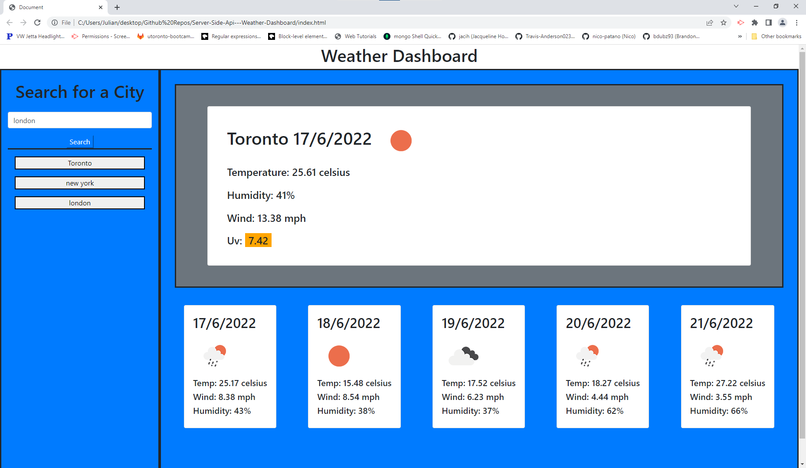

# Weather Dashboard 

## Description

### What does Weather Dashboard do?

Uses the OpenWeather One Call API to probe appropriate information and generate a weather dashboard.


## Table of Contents

- [Installation](#installation)
- [Usage](#usage)
- [Credits](#credits)
- [Contribution](#contribution)
- [Questions](#questions)
- [Licence](#licence)

---

## Installation 

### Technologies Used in Development

Technologies used include:

Html and Javascript

### Installation Instructions

```md
Create an account with openweather to get your own set of api keys
```

## Usage



```md
View in browser or will add link here
```

## Credits

OpenWeather and myself

## Contribution

Guidelines for contribution:

No contribution necessary.

## Questions

No contact.

https://github.com/jq67


---
## Licence
This project is covered under the `Mit License`